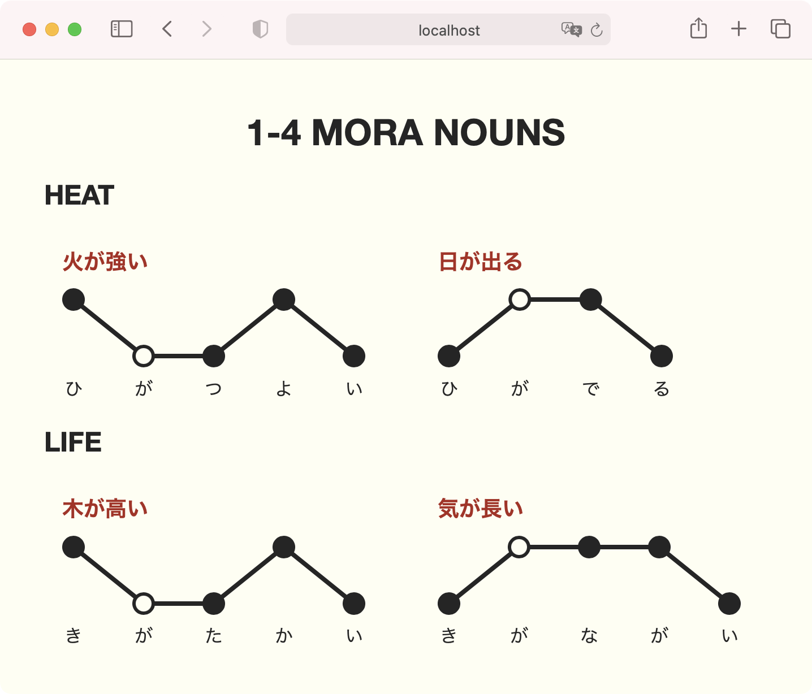

# jp-pitch-accent

A demo of how to use Svelte components (particularly Rich Harris's brilliant [@sveltejs/pancake](https://github.com/Rich-Harris/pancake) graphing library) to take Japanese pitch accent notes. Please do check out [Dōgen](https://www.patreon.com/dogen) on Patreon, as its his exceptional lessons I'm learning from!

It's not my immediate plan to refactor this into an installable library, but if there is interest, I may consider it.

These pitch accent graphs, once rendered, do not depend on JavaScript to run. So you could theoretically copy the generated SVG and **use them in Anki flashcards** – just be sure to fill in the necessary CSS variables.

## Example



## Get started

Install the dependencies...

```bash
cd svelte-app
npm install
```

...then start [Rollup](https://rollupjs.org):

```bash
npm run dev
```

Navigate to [localhost:5000](http://localhost:5000). You should see your app running. Edit a component file in `src`, save it, and reload the page to see your changes.

By default, the server will only respond to requests from localhost. To allow connections from other computers, edit the `sirv` commands in package.json to include the option `--host 0.0.0.0`.

If you're using [Visual Studio Code](https://code.visualstudio.com/) we recommend installing the official extension [Svelte for VS Code](https://marketplace.visualstudio.com/items?itemName=svelte.svelte-vscode). If you are using other editors you may need to install a plugin in order to get syntax highlighting and intellisense.

## Licence

[MIT licensed](LICENCE).